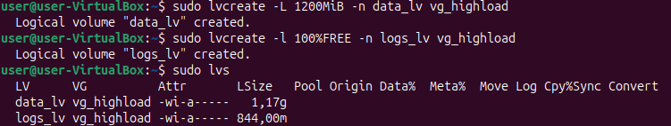

## Задание 1. Kernel and Module Inspection

### 1. Продемонстрировать версию ядра  ОС.

```
uname -r
```

**Результат:**


### 2. Показать все загруженные модули ядра.

```
lsmod
```
**Результат:**


### 3. Отключить автозагрузку модуля cdrom.

Домашнее задание выполняется на ОС Ubuntu Linux, которая запущена с помощью VirtualBox.
В VirtualBox модуль cdrom отсутствует, потому что виртуальная машина не использует физический CD/DVD-привод.
Linux видит виртуальные ISO-диски через встроенные драйверы SCSI/SATA (sr_mod),
поэтому отдельный модуль cdrom не нужен и не загружается. Проверка через lsmod подтверждает его отсутствие.

```
lsmod | grep -i cdrom
```

**Результат:**


В образовательных целях проделаем операцию отключения автозагрузки модуля

```
echo "blacklist cdrom" | sudo tee /etc/modprobe.d/blacklist-cdrom.conf
echo "blacklist sr_mod" | sudo tee -a /etc/modprobe.d/blacklist-cdrom.conf
```

**Результат:**


**Пояснение:**

Таким образом был создан конфигурационный файл, в котором строка `blacklist cdrom` сообщает системе не загружать модуль 
cdrom автоматически, а строка `blacklist sr_mod` - не загружать драйвер виртуального CD/DVD.

### 4. Найти и описать конфигурацию ядра (файл конфигурации, параметр CONFIG_XFS_FS).

**Найдём файл конфигурации ядра:**

```
ls /boot/config-$(uname -r)
```

**Результат:**


**Проверим параметр CONFIG_XFS_FS:**

```
grep CONFIG_XFS_FS /boot/config-$(uname -r)
```

**Результат:**


**Пояснение:**

Поддержка XFS реализована как модуль. Можно узнать подробнее через `modinfo`

```
modinfo xfs
```

**Результат:**


## Задание 2. Наблюдение за VFS

```
strace -e trace=openat,read,write,close cat /etc/os-release > /dev/null
```

strace - отслеживает системные вызовы.

cat - отображает содержимое одного или нескольких файлов в терминале

**Системные вызовы, которые мы отслеживаем:**

- openat - открытие файлов и директорий;
- read - чтение данных из файла;
- write - запись данных в файл;
- close - закрытие файлового дескриптора.

**Результат:**


**Пояснение:**

В Linux у процесса всегда есть три стандартных дескриптора: 0 - stdin (ввод), 1 - stdout (вывод), 2 - stderr (ошибки).

- Сначала cat загружает нужные библиотеки (ld.so.cache, libc.so.6, locale-archive).

- Потом открывает основной файл /etc/os-release, ядро даёт ему новый дескриптор 3.

- Через read(3, …) читает из него 400 байт текста.

- Через write(1, …) отправляет эти данные в стандартный вывод (дескриптор 1 - stdout), однако оболочка заранее перенаправила stdout в /dev/null, поэтому весь вывод уходит в «чёрную дыру» и текст из файла в терминале отсутствует.

- В конце cat закрывает: 3 (файл /etc/os-release), 1 (/dev/null вместо экрана) и 2 (stderr).

**Итого:** `cat` читает `/etc/os-release` (дескриптор 3) и пишет в `stdout` (дескриптор 1), но вывод оказывается в 
`/dev/null`, поэтому ничего не видно. Записывающие вызовы `write` в выводе могут отсутствовать, если `cat` использует оптимизированные системные вызовы копирования данных внутри ядра (`copy_file_range, sendfile, splice`), которые не требуют традиционных операций записи из пользовательского пространства.

## Задание 3. LVM Management

### 1. Добавить к своей виртуальной машине диск /dev/sdb размером 2GB.


**Проверка:**

```
lsblk
```

**Результат:**


### 2. Создать раздел на /dev/sdb, используя fdisk или parted.

```
sudo fdisk /dev/sdb
```

**Далее:**

* `n` - новый раздел
* `p` - primary
* `1` - номер раздела
* `enter` - (по умолчанию)
* `enter` - (по умолчанию)
* `t` - изменить тип - `8e` (Linux LVM)
* `p` - проверить
* `w` - сохранить

**Результат:**


**Проверка:**

```
lsblk /dev/sdb
```

**Результат:**


### 3. Создать Physical Volume (PV)

```
sudo pvcreate /dev/sdb1
sudo pvs
```

**Результат:**


### 4. Создать Volume Group (VG) с именем vg_highload

```
sudo vgcreate vg_highload /dev/sdb1
sudo vgs
```

**Результат:**


### 5. Создать два Logical Volume (LV)

**Первый (1200 MiB):**

```
sudo lvcreate -L 1200MiB -n data_lv vg_highload
```

**Второй (оставшееся место):**

```
sudo lvcreate -l 100%FREE -n logs_lv vg_highload
```

**Проверка:**

```
sudo lvs
```

**Результат:**



### 6. Отформатировать data_lv как ext4 и logs_lv как xfs

**ext4 для data_lv:**

```
sudo mkfs.ext4 /dev/vg_highload/data_lv
```

**xfs для logs_lv:**

```
sudo mkfs.xfs /dev/vg_highload/logs_lv
```

**Результат:**


### 7. Примонтировать data_lv в /mnt/app_data и logs_lv в /mnt/app_logs

**Создаём каталоги:**

```
sudo mkdir -p /mnt/app_data /mnt/app_logs
```

**Монтируем:**

```
sudo mount /dev/vg_highload/data_lv /mnt/app_data
sudo mount /dev/vg_highload/logs_lv /mnt/app_logs
```

**Проверка:**

```
df -h | grep app_
```

**Результат:**


## Задание 4. Использование pseudo filesystem

### 1. Извлечь из /proc модель CPU и объём памяти (KiB)

```
grep "model name" /proc/cpuinfo | head -1
grep "MemTotal" /proc/meminfo
```

**Результат:**


**Пояснение:**

* `cpuinfo` - содержит сведения о процессоре
* `meminfo` - общий объём ОЗУ в KiB

### 2. Найти Parent Process ID (PPid) текущего shell, используя /proc/$$/status

```
grep PPid /proc/$$/status
```

**Результат:**


**Пояснение:**

`$$` - это PID текущего shell-процесса (переменная окружения bash/zsh и т.д.).
Через `status` можно узнать его родительский процесс (PPid). 

### 3. Определить настройки I/O scheduler для основного диска /dev/sda.

```
cat /sys/block/sda/queue/scheduler
```

**Результат:**


**Пояснение:**

У диска `/dev/sda` доступно два планировщика ввода-вывода: `none` и `mq-deadline`.
Текущий активный отмечен квадратными скобками - это `mq-deadline`.

`mq-deadline` - это адаптация планировщика ввода-вывода `deadline`, но разработанная для устройств с несколькими очередями. 

### 4. Определить размер MTU для основного сетевого интерфейса

```
cat /sys/class/net/enp0s3/mtu
```

**Результат:**


**Пояснение:**

MTU (Maximum Transmission Unit) - это максимальный размер одного пакета данных,
который может быть передан по сети без фрагментации. В данном случае он равен размеру по умолчанию в 1500 байт.